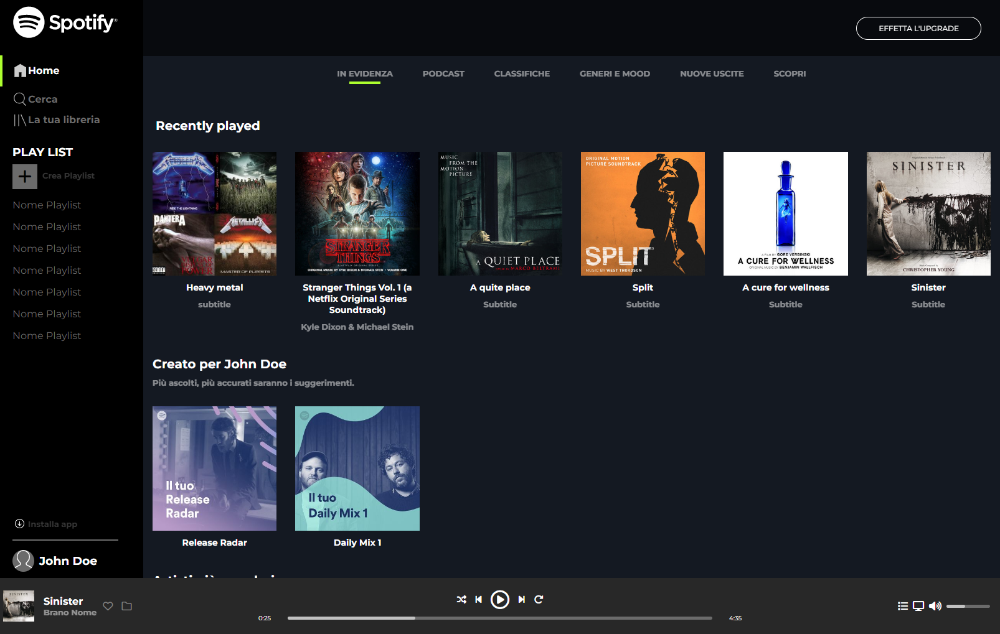

# Spotify website (replica)
In this project, which is an exercise from Boolean Academy, I have developed a replica of Spotify website using HTML and CSS.   The website is designed to be responsive, adapting to various screen sizes, thanks to the implementation of media queries. You can explore the result by clicking on the link provided below:  
https://enriconapolitano.github.io/html-css-spotifyweb/

